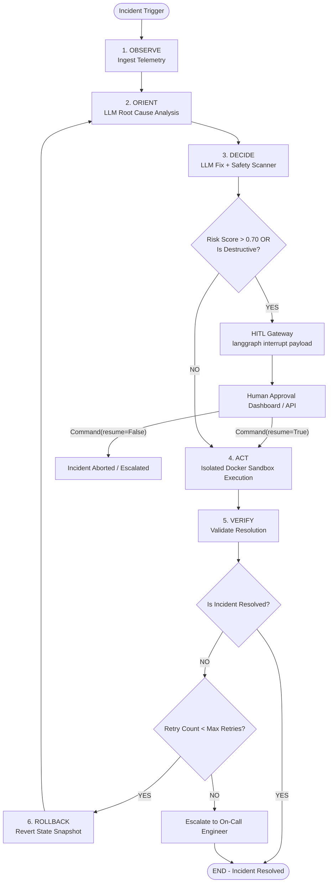

# 🛡️ OODA-Kernel

> **Autonomous Incident Remediation Engine with Human-in-the-Loop (HITL) Guardrails & Stateful Self-Healing Loops**

[](https://python.org)
[](https://github.com/langchain-ai/langgraph)
[](https://fastapi.tiangolo.com)
[](https://docker.com)
[](LICENSE)

---

## 📖 Overview

**OODA-Kernel** is a stateful, autonomous AI agent engine designed to diagnose, remediate, and verify infrastructure incidents (Kubernetes crash loops, database connection saturation, memory exhaustion) in real time. 

Built on the **Observe-Orient-Decide-Act (OODA)** loop, OODA-Kernel combines **dynamic LLM reasoning** with **strict deterministic safety guardrails** and **human operator sign-offs** to safely automate DevOps incident recovery without risking production stability.

---

## ⚡ Key Features

- **🔄 Stateful OODA State Machine**: Built on **LangGraph** with append-only state reducers (`typing.Annotated[List[...], operator.add]`) to prevent state corruption during async execution.
- **🛡️ Human-in-the-Loop (HITL) Safety Gate**: Automatically pauses execution via `langgraph.types.interrupt()` whenever an action exceeds risk thresholds (`risk_score > 0.70` or `is_destructive=True`).
- **🔍 Deterministic Safety Policy Scanner**: Keyword AST/regex scanner overlay (`rm -rf`, `DROP TABLE`, `kubectl delete`) that forces `risk_score >= 0.95` and `is_destructive=True` to guarantee HITL approval triggers even if an LLM under-predicts risk.
- **🔁 Self-Healing & Time-Travel Rollbacks**: Uses checkpointer snapshots (`MemorySaver` / `SqliteSaver`) to rewind state and initiate re-orientation loops if post-action verification fails (`max_retries = 3`).
- **🐳 Isolated Execution Sandbox**: Executes bash commands in containerized Docker sandboxes (`--cap-drop=ALL`) with automatic mock fallback when container daemons are offline.
- **🌐 Universal LLM Provider Integration**: Uses a unified `LLM_API_KEY` and `LLM_BASE_URL` adapter supporting **OpenRouter**, **NVIDIA NIMs**, **Groq**, **Ollama**, **OpenAI**, and custom endpoints.
- **🖥️ Streamlit HITL Control Panel**: Interactive operator dashboard for live incident monitoring, risk gauges, command approvals, and step history inspection.

---

## 📐 System Architecture



---

## 📁 Repository Directory Structure

```text
ooda_kernel/
├── app/
│   ├── agents/          # LangGraph state machine & nodes
│   │   ├── observe.py   # Telemetry ingestion & normalization
│   │   ├── orient.py    # LLM topological root-cause analysis
│   │   ├── decide.py    # LLM decision engine & Safety Guardrail Scanner
│   │   ├── act.py       # Isolated container execution node
│   │   ├── verify.py    # Post-action verification node
│   │   ├── rollback.py  # State snapshot rollback node
│   │   └── graph.py     # Compiled StateGraph with checkpointer & interrupt gateway
│   ├── api/             # FastAPI REST engine
│   │   ├── main.py      # FastAPI router application
│   │   └── endpoints.py # /submit, /approve, /state endpoints
│   ├── core/            # System configuration & schemas
│   │   ├── config.py    # Provider config (LLM_API_KEY, LLM_BASE_URL)
│   │   └── state.py     # IncidentState TypedDict with Annotated reducers
│   ├── sandbox/         # Security & sandboxing
│   │   └── docker_exec.py # Isolated runner with mock fallback mode
│   └── ui/              # Control panel dashboard
│       └── dashboard.py # Streamlit HITL dashboard
├── tests/               # Test suites
│   ├── test_llm_decide.py # Safety policy & LLM config unit tests
│   ├── test_ooda_flow.py  # E2E graph & HITL integration tests
│   └── test_sandbox.py    # Sandbox & fallback unit tests
└── pyproject.toml       # Project metadata & dependencies
```

---

## 🚀 Quick Start Guide

### 1. Installation

Clone the repository and install dependencies using `uv`:

```bash
# Install package in editable mode with development dependencies
uv pip install -e ".[dev]"
```

### 2. Configure LLM Provider (Optional)

Export environment variables for your preferred provider (OpenRouter, NVIDIA NIMs, OpenAI, Groq, Ollama):

```bash
# Option A: OpenRouter
export LLM_API_KEY="sk-or-v1-..."
export LLM_BASE_URL="https://openrouter.ai/api/v1"
export LLM_MODEL="anthropic/claude-3.5-sonnet"

# Option B: NVIDIA NIMs
export LLM_API_KEY="nvapi-..."
export LLM_BASE_URL="https://integrate.api.nvidia.com/v1"
export LLM_MODEL="meta/llama-3.1-70b-instruct"

# Note: If no API key is set, OODA-Kernel gracefully uses its built-in heuristic engine.
```

### 3. Start API Server & Dashboard

Launch the FastAPI backend and Streamlit HITL control panel:

```bash
# Terminal 1: Launch FastAPI REST Server (Port 8000)
uvicorn app.api.main:app --reload --port 8000

# Terminal 2: Launch Streamlit HITL Dashboard (Port 8501)
streamlit run app/ui/dashboard.py
```

Open your browser to `http://localhost:8501` to view the Streamlit HITL Dashboard!

---

## 🧪 Running the Test Suite

Run the full pytest suite (11+ unit & E2E tests):

```bash
uv run pytest tests/ -v
```

---

## 🔌 API Reference

### `POST /api/incident/submit`
Submits raw telemetry and initiates state graph execution.
```json
{
  "telemetry": "2026-08-16 11:00:00 [ERROR] Connection pool exhausted: postgresql://db:5432",
  "max_retries": 3
}
```

### `POST /api/incident/{incident_id}/approve`
Resumes execution of an interrupted incident after human approval.
```json
{
  "approved": true,
  "operator_notes": "Approved restart during maintenance window."
}
```

### `GET /api/incident/{incident_id}/state`
Retrieves current state snapshot, step history log, and checkpoint metadata.

---

## 🛡️ License

Distributed under the MIT License. See `LICENSE` for more information.
