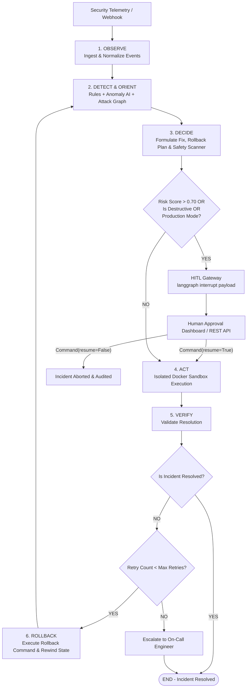

# 🛡️ OODA-Kernel

> **Evidence-Grounded Autonomous Cyber Defense & Incident Remediation Engine with Stateful OODA Loops and Human-in-the-Loop (HITL) Guardrails**

[](https://python.org)
[](https://github.com/langchain-ai/langgraph)
[](https://fastapi.tiangolo.com)
[](https://docker.com)
[](tests/)
[](LICENSE)

---

## 📖 Overview

**OODA-Kernel** is a stateful, autonomous AI agent platform designed to observe security telemetry, detect anomalies, reconstruct attack graphs, formulate risk-aware remediation scripts, execute actions safely inside isolated container sandboxes, and verify system recovery in real time. 

Built on the **Observe-Orient-Decide-Act (OODA)** loop, OODA-Kernel combines **dynamic LLM reasoning** with **strict deterministic safety policy scanners**, **NetworkX attack graphs**, and **human operator sign-offs** to safely automate DevOps incident recovery without risking production stability.

---

## ⚡ Key Features

- **🔄 Stateful OODA State Machine**: Built on **LangGraph** with append-only state reducers (`typing.Annotated[List[...], operator.add]`) and `SqliteSaver` checkpointing (`ooda_checkpoint.db`) to guarantee state retention across server restarts.
- **🛡️ Deterministic Safety Policy Scanner**: Keyword AST & regex scanner overlay (`rm -rf`, `DROP TABLE`, `kubectl delete`) that forces `risk_score >= 0.95` and `is_destructive=True` to guarantee HITL approval triggers even if an LLM under-predicts command risk.
- **🚨 Human-in-the-Loop (HITL) Safety Gate**: Automatically pauses graph execution via `langgraph.types.interrupt()` whenever an action exceeds risk thresholds (`risk_score > 0.70`), is destructive, or runs in `production` mode.
- **🔍 Security Event & Detection Engine**: Normalizes telemetry logs into standard `SecurityEvent` models, applying deterministic rules and statistical anomaly detection ([app/detection/](file:///d:/Area%2051/ooda_kernel/app/detection)).
- **🕸️ Attack Graph Reconstruction**: Builds evidence-grounded NetworkX attack graphs and maps observed adversary behavior to the **MITRE ATT&CK** framework ([app/investigation/](file:///d:/Area%2051/ooda_kernel/app/investigation)).
- **🔁 Self-Healing & Automated Rollbacks**: Formulates explicit `rollback_command` parameters and executes snapshot rollbacks automatically upon post-action verification failure.
- **🐳 Isolated Execution Sandbox**: Executes bash commands inside containerized Docker sandboxes (`--cap-drop=ALL`) with configurable execution targets (`mock`, `staging`, `production`) and automatic mock fallback.
- **📡 WebSockets & Live Webhooks**: Real-time bi-directional telemetry streaming via `/ws/telemetry` and native formatters for **Prometheus Alertmanager**, **PagerDuty**, and **OpenTelemetry**.
- **🖥️ Interactive SOC Control Panel**: Streamlit operator dashboard featuring interactive Graphviz state DAGs, node status color-coding (`PENDING`, `RUNNING`, `PAUSED_HITL`, `RESOLVED`, `FAILED`), inline latency (ms) meters, 60s countdown diff cards, and immutable audit logs.

---

## 📐 System Architecture



---

## 📁 Repository Directory Structure

```text
ooda_kernel/
├── app/
│   ├── agents/          # LangGraph state machine & OODA nodes
│   │   ├── observe.py   # Telemetry ingestion & event normalization
│   │   ├── orient.py    # Topological root-cause analysis & ATT&CK mapping
│   │   ├── decide.py    # LLM decision engine & AST Safety Guardrail Scanner
│   │   ├── act.py       # Isolated container execution node
│   │   ├── verify.py    # Post-action verification node
│   │   ├── rollback.py  # Automated rollback node & audit trail logging
│   │   └── graph.py     # Compiled StateGraph with SqliteSaver & HITL gateway
│   ├── api/             # FastAPI REST & WebSocket server
│   │   ├── main.py      # FastAPI application entry point
│   │   └── endpoints.py # REST, /ws/telemetry stream & webhook handlers
│   ├── core/            # System configuration & IncidentState definitions
│   │   ├── config.py    # Provider config (LLM_API_KEY, LLM_BASE_URL)
│   │   ├── llm_factory.py # Unified OpenAI / NVIDIA NIM provider factory
│   │   └── state.py     # TypedDict state model with Annotated reducers
│   ├── security/        # Normalized security events & MITRE taxonomy
│   ├── detection/       # Rule-based & statistical anomaly detection
│   ├── investigation/   # NetworkX attack graph & timeline reconstruction
│   ├── sandbox/         # Hardened Docker sandbox (mock, staging, production)
│   └── ui/              # Control panel dashboard
│       └── dashboard.py # Streamlit SOC dashboard with Graphviz DAG visualizer
├── tests/               # 25 passed unit & integration tests
│   ├── unit/            # Unit tests for security, detection & investigation
│   ├── test_llm_decide.py # Safety policy & LLM decision unit tests
│   ├── test_ooda_flow.py  # E2E graph flow & HITL approval integration tests
│   └── test_sandbox.py    # Sandbox runner & fallback unit tests
└── pyproject.toml       # Dependencies & project configuration
```

---

## 🚀 Quick Start Guide

### 1. Installation

Clone the repository and install dependencies using `uv`:

```bash
# Install package in editable mode with development dependencies
uv pip install -e ".[dev]"
```

### 2. Configure LLM Provider (Optional)

Export environment variables for your preferred provider (OpenRouter, NVIDIA NIMs, OpenAI, Groq, Ollama):

```bash
# Option A: OpenRouter
export LLM_API_KEY="sk-or-v1-..."
export LLM_BASE_URL="https://openrouter.ai/api/v1"
export LLM_MODEL="anthropic/claude-3.5-sonnet"

# Option B: NVIDIA NIMs
export LLM_API_KEY="nvapi-..."
export LLM_BASE_URL="https://integrate.api.nvidia.com/v1"
export LLM_MODEL="meta/llama-3.1-70b-instruct"

# Note: If no API key is set, OODA-Kernel gracefully uses its built-in heuristic engine.
```

### 3. Start API Server & Dashboard

Launch the FastAPI backend and Streamlit HITL control panel:

```bash
# Terminal 1: Launch FastAPI REST Server (Port 8000)
uvicorn app.api.main:app --reload --port 8000

# Terminal 2: Launch Streamlit SOC Dashboard (Port 8501)
streamlit run app/ui/dashboard.py
```

Open your browser to `http://localhost:8501` to access the Streamlit SOC Control Panel!

---

## 🧪 Running the Test Suite

Run the full pytest suite (25 unit & E2E integration tests):

```bash
uv run pytest tests/ -v
```

---

## 🔌 API Reference

### `POST /api/incident/submit`
Submits telemetry and initiates graph execution.
```json
{
  "telemetry": "2026-08-16 11:00:00 [ERROR] Connection pool exhausted: postgresql://db:5432",
  "execution_mode": "mock",
  "max_retries": 3
}
```

### `POST /api/incident/{incident_id}/approve`
Resumes interrupted execution following operator approval.
```json
{
  "approved": true,
  "operator_id": "operator-42",
  "operator_notes": "Approved restart during maintenance window."
}
```

### `GET /api/incident/{incident_id}/state`
Retrieves current state snapshot, step history log, attack graph, and checkpoint metadata.

### `WS /ws/telemetry`
Bi-directional WebSocket endpoint for live telemetry streaming and state progression updates.

### Webhook Alerts Ingest
- `POST /api/incident/webhook/alertmanager` (Prometheus Alertmanager format)
- `POST /api/incident/webhook/pagerduty` (PagerDuty v2 event format)
- `POST /api/incident/webhook/otel` (OpenTelemetry JSON format)

---

## 🛡️ License

Distributed under the MIT License. See `LICENSE` for more information.
